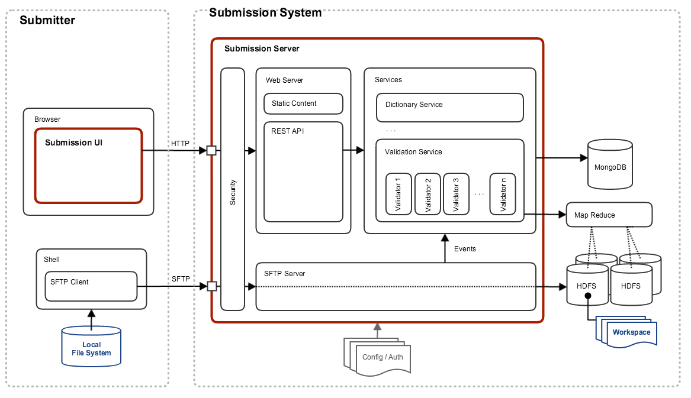
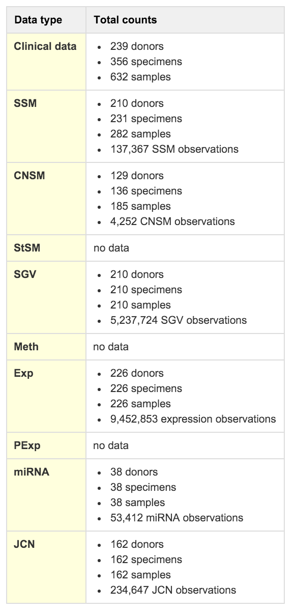
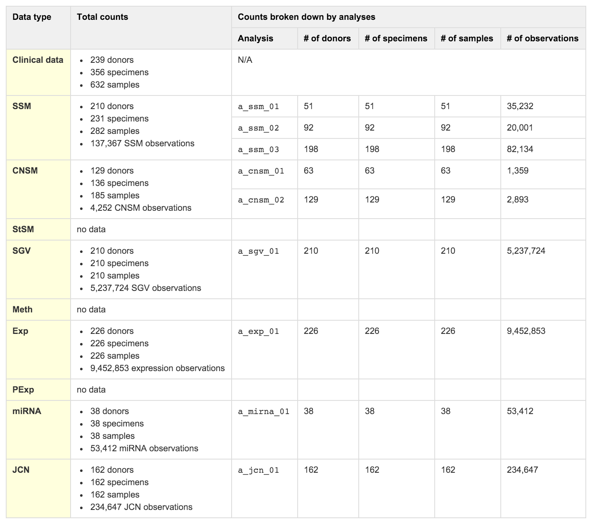

# ICGC DCC - Submission Architecture
## Overview

The submission system is single-node Java based microservice with a RESTful API that powers a SPA (Single Page Application) front-end. Users interact with the system by way of the UI, API as well as an SFTP interface for uploading files.



Additional user guides may be found on the [ICGC DCC Docs site](http://docs.icgc.org/submission/about/).

The backend Java modules rely heavily on [Lombok](https://projectlombok.org/) to minimize boilerplate code and type noise that is typical of Java applications.

 
## Storage

System metadata and user submitted files are handled separately within the system. Metadata is stored in MongoDB while files are stored in Hadoop HDFS. 


### File

All files are directly streamed from SFTP to HDFS

- [Hadoop](http://hadoop.apache.org/)

Files are stored in the following directory structure:

```
[baseDir]/ICGC{release}/{projectCode}
```

where `baseDir ` is the root path in HDFS, `{release}` is a release number, and `{projectCode}` is a system registered project code.

### Metadata

Metadata is stored in MongoDB with a simple schema, comprised of the following collections, organized by function:

#### Dictionary

- `CodeList`
- `Dictionary`

#### User

- `Project`
- `User`

#### Release

- `Release`

#### Reporting

- `ProjectDataTypeReport`
- `ProjectSequencingStrategyReport`

Which stores the following reports

|`ProjectDataTypeReport`|`ProjectSequencingStrategyReport`|
|----------------------------|----------------------------|
|||


